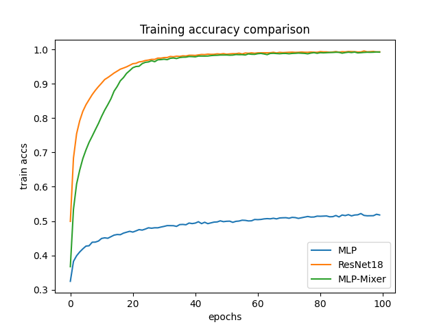

# Build Image Classification Models with PyTorch
### Follow the instructions to build three classic image classification models:
- MLP
- ResNet18
- MLP-Mixer

## Basic usage
<code>python main.py --model <model_name> --model_config <path_to_json> --logdir <result_dir> ...</code>

Please see config.py for other command line usage.

### Examples

#### Train MLP model

<code>python main.py --batch_size 128 --model mlp --model_config ./model_configs/mlp.json --epochs 100 --logdir ./train_log/mlp --device cuda</code>

#### Train ResNet18 model

<code>python main.py --batch_size 128 --model resnet18 --model_config ./model_configs/resnet18.json --epochs 100 --optimizer adam --lr 0.001 --logdir ./train_log/resnet --device cuda</code>

#### Train MLP-Mixer model

<code>python main.py --batch_size 128 --model mlpmixer --model_config ./model_configs/mlpmixer.json --epochs 15 --lr 0.1 --logdir ./train_log/mixer --device cuda</code>

## Results
Comparison of the best results for the three models:

Hyperparameters used by the above models:
|Hyperparameters|Value|
|---|---|
|MLP|default|
|ResNet18|batch size=64, weight decay=1e-3, number of epochs=100|
|MLP-Mixer|learning rate=1e-3, embedding dimension=512, number of blocks=6, number of epochs=84|

## Visualization
### The kernels of the first layer of ResNet18
First normalized all the weights of the kernels of the first layer of ResNet18 (map them between 0 and 1), then averaged each $3 \times 3 \times 3$ image in the channel dimension, and finally got 64 $3 \times 3$ grayscale images, as shown in the figure below.

### The weights of the first layer of token-mixing MLP in the first block of MLPMixer
The first layer of token-mixing MLP in the first block of MLPMixer has a dimension of $128 \times 64$, so just normalized the weights of this layer (mapping them between 0 and 1) and displayed the result as 128 $8 \times 8$ grayscale images, as shown in the figure below.

### Analysis
We can see that the first layer of token-mixing MLP is the same as the first layer of ResNet18 with many pairs of feature detectors with opposite phases. But since token-mixing allows global communication between different spatial locations, there will be some learned features that operate on the entire image, while others operate on smaller regions. In contrast, ResNet18 tends to only learn detectors that act on pixels in local regions of an image.  
